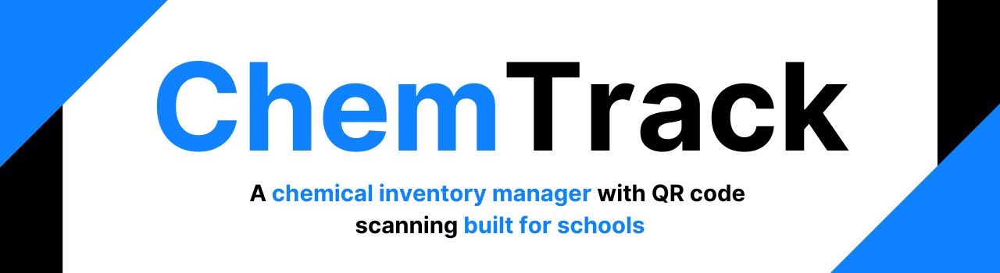
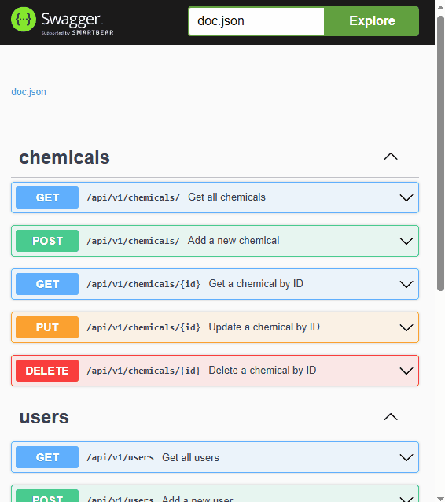
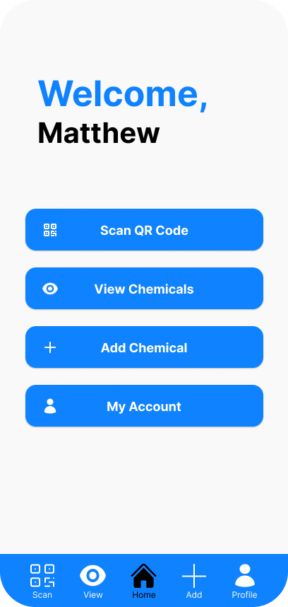
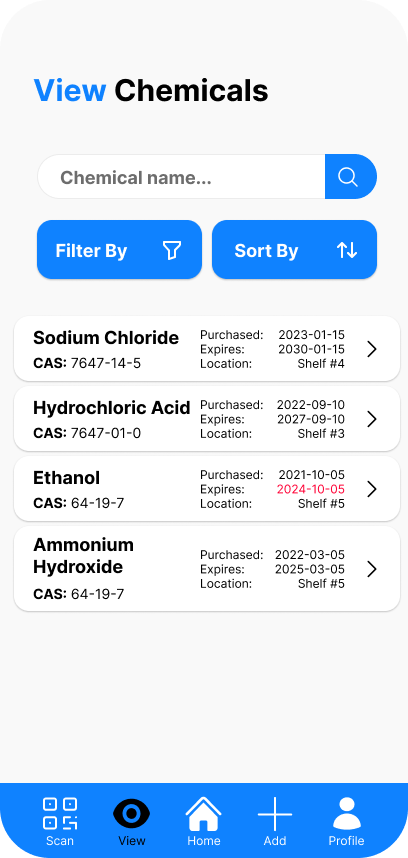

<p align="center">
   
</p>

# ChemTrack
A chemical inventory manager with QR code scanning built for schools.

## Table of Contents
- [Introduction](#introduction)
- [Contributors](#contributors)
- [Prerequisites](#prerequisites)
- [Setup](#setup)
  - [Backend](#backend)
  - [Frontend](#frontend)
- [Running the Project](#running-the-project)
  - [Backend](#running-the-backend)
  - [Frontend](#running-the-frontend)
- [Testing](#testing-to-do)
- [Deployment](#deployment-to-do)
- [API Endpoints](#api-endpoints)
- [UI Images](#ui-images)
- [Key Milestones](#key-milestones-for-191)
- [Additional Information](#additional-information)

## Introduction
ChemTrack is an innovative chemical inventory management system designed specifically for educational institutions. This powerful tool leverages QR code technology to streamline the tracking and management of chemical inventories, ensuring safety and compliance in school laboratories.

With ChemTrack, users can easily add, view, and manage chemical details, including CAS numbers, purchase and expiration dates, storage locations, and quantities. The system provides real-time updates and alerts for expired or low-quantity chemicals, helping schools maintain a safe and well-organized chemical inventory.

ChemTrack's user-friendly interface allows for quick access to Safety Data Sheets (SDS) and other critical information, ensuring that all necessary safety protocols are readily available. The software also supports the generation and printing of QR codes for each chemical, enabling efficient scanning and retrieval of chemical data.

Designed with scalability and ease of use in mind, ChemTrack integrates seamlessly with existing school systems and provides robust reporting and analytics features. Whether you're a science teacher, lab technician, or school administrator, ChemTrack offers a comprehensive solution to manage your chemical inventory with confidence and ease.

#### Technologies Used
ChemTrack is built using a modern technology stack to ensure reliability, scalability, and ease of use:

#### Frontend
React Native: For building a cross-platform mobile application that runs on both iOS and Android devices, providing a seamless user experience.
Expo: To streamline the development process, allowing for quick testing and deployment of the React Native application.
Axios: For making HTTP requests to the backend API, ensuring efficient data retrieval and manipulation.
TypeScript: To add static typing to JavaScript, enhancing code quality and maintainability.
#### Backend
Go (Golang): A statically typed, compiled programming language known for its performance and efficiency, used to build the backend API.
Gin: A high-performance HTTP web framework for Go, used to create robust and scalable RESTful APIs.
Google Cloud Firestore: A flexible, scalable database for mobile, web, and server development, used to store chemical data securely.
Google Cloud Storage: For storing and serving QR code images and other static assets.
bcrypt: For securely hashing and storing user passwords, ensuring data security.
#### Additional Tools
Swagger: For API documentation, making it easy for developers to understand and interact with the backend services.
Docker: To containerize the application, ensuring consistent environments across development, testing, and production.
GitHub: For version control and collaboration, enabling seamless teamwork and code management.
By leveraging these cutting-edge technologies, ChemTrack ensures a reliable, efficient, and user-friendly experience for managing chemical inventories in educational institutions.

## Contributors
- Rahul Gupta
- Ekjyot Shinh
- Ajaydeep Singh
- Katy Chan
- Mari Moslehi
- Harmanjot Singh
- Romin Akoliya
- Kevin Esquivel

## Prerequisites
- Node.js (v14 or higher)
- npm or yarn
- Go (v1.16 or higher)
- Expo CLI (`npm install -g expo-cli`)

## Setup

### Backend
1. Navigate to the `backend` directory:
    ```sh
    cd backend
    ```
2. Install Go dependencies:
    ```sh
    go mod tidy
    ```
3. Set up environment variables:
    - Create a `.env` file in the `backend` directory and add your environment variables.

### Frontend
1. Navigate to the `frontend` directory:
    ```sh
    cd frontend
    ```
2. Install Node.js dependencies:
    ```sh
    npm install
    ```
    or
    ```sh
    yarn install
    ```

## Running the Project

### Running the Backend
1. Navigate to the [backend] directory:
    ```sh
    cd backend
    ```
2. Start the backend server:
    ```sh
    go run main.go
    ```
3. The backend server should now be running on `http://localhost:8080`.

### Running the Frontend
1. Navigate to the [frontend] directory:
    ```sh
    cd frontend
    ```
2. Start the Expo development server:
    ```sh
    npm start
    ```
    or
    ```sh
    yarn start
    ```
3. Install notification dependencies:
    ```sh
    npm install expo-notifications expo-constants
    ```

4. Expo Project Setup:
   - Make sure you're logged into your Expo account:
     ```sh
     npx expo login
     ```
   - Get your Expo project ID by running:
     ```sh
     npx expo projects
     ```
   - Add your Expo project ID to your .env file:
     ```
     EXPO_PROJECT_ID=your_project_id_here
     ```
   Note: Without the correct project ID in your .env file, push notifications won't work properly.
   
5. Testing Notifications:
   - Download the Expo Go app from App Store (iOS) or Play Store (Android)
   - Create and sign in to your Expo account in the Expo Go app
   - Note: You must be signed in to the same Expo account on both your development environment and the Expo Go app for notifications to work properly.

## Testing (To Do)

## Deployment (To Do)
1. Requirements
   
2. Steps for Deployment

## API Endpoints
Refer to the ```http://localhost:8080/swagger/index.html#/``` when running the backend for a list of available API endpoints and their usage.

<p align="center">
    
</p>


## UI Images
Created in Figma
<p align="center">
  
  
  
</p>

## Key Milestones for 191
- SDS viewing & uploading
- Inviting user backend functionality
- User type implementation
- QR code scanning and routing
- Label printing & generation


## Additional Information
- For more details on the project structure and code, refer to the individual files and directories.
- Ensure that you have the necessary environment variables set up for both the backend and frontend to function correctly.
- The app includes push notification functionality for alerting users about chemical updates. Users will be prompted to enable notifications when first accessing the app.
