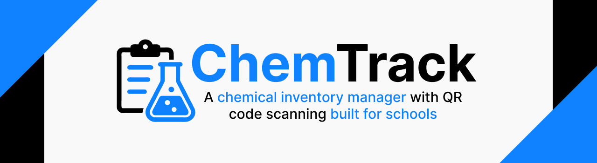

<p align="center">
   
</p>

# ChemTrack

ChemTrack is a mobile app for managing chemical inventory in schools, featuring built-in QR code scanning. It was designed, developed, and tested from the ground up for the chemistry department at Encina High School to streamline their inventory management process.

## Table of Contents

-   [Introduction](#introduction)
    - [Tech Stack](#technologies-used)
        - [Frontend](#frontend)
        - [Backend](#backend)
        - [Additional Tools](#additional-tools)
-   [Application Demo](#application-demo)
-   [Contributors](#contributors)
-   [Prerequisites](#prerequisites)
-   [Setup](#setup)
    -   [Backend](#backend-1)
    -   [Frontend](#frontend-1)
-   [Running the Project](#running-the-project)
    -   [Backend](#running-the-backend)
    -   [Frontend](#running-the-frontend)
-   [Testing](#testing)
    -   [Backend Testing Environment](#setting-up-the-backend-testing-environment)
        -   [Clear Firestore Emulator Data](#clear-firestore-emulator-data-before-consecuitive-runs)
    -   [Backend Testing](#backend-testing)
    -   [Frontend Testing](#frontend-testing)
-   [Deployment](#deployment)
    -   [Frontend Deployment](#frontend-deployment-mobile-app-via-expo-eas)
    -   [Backend Deployment](#backend-deployment-docker--google-cloud-run)
-   [Secrets Management](#secrets-management)
-   [API Endpoints](#api-endpoints)
-   [Additional Information](#additional-information)

<!--  -->

## Introduction

ChemTrack is an innovative chemical inventory management system designed specifically for educational institutions. This powerful tool leverages QR code technology to streamline the tracking and management of chemical inventories, ensuring safety and compliance in school laboratories.

With ChemTrack, users can easily add, view, and manage chemical details, including CAS numbers, purchase and expiration dates, storage locations, and quantities. The system provides real-time updates and alerts for expired or low-quantity chemicals, helping schools maintain a safe and well-organized chemical inventory.

ChemTrack's user-friendly interface allows for quick access to Safety Data Sheets (SDS) and other critical information, ensuring that all necessary safety protocols are readily available. The software also supports the generation and printing of QR codes for each chemical, enabling efficient scanning and retrieval of chemical data.

Designed with scalability and ease of use in mind, ChemTrack integrates seamlessly with existing school systems and provides robust reporting and analytics features. Whether you're a science teacher, lab technician, or school administrator, ChemTrack offers a comprehensive solution to manage your chemical inventory with confidence and ease.

#### Technologies Used

ChemTrack is built using a modern technology stack to ensure reliability, scalability, and ease of use:

#### Frontend

React Native: For building a cross-platform mobile application that runs on both iOS and Android devices, providing a seamless user experience.
Expo: To streamline the development process, allowing for quick testing and deployment of the React Native application.
Axios: For making HTTP requests to the backend API, ensuring efficient data retrieval and manipulation.
TypeScript: To add static typing to JavaScript, enhancing code quality and maintainability.

#### Backend

Go (Golang): A statically typed, compiled programming language known for its performance and efficiency, used to build the backend API.
Gin: A high-performance HTTP web framework for Go, used to create robust and scalable RESTful APIs.
Google Cloud Firestore: A flexible, scalable database for mobile, web, and server development, used to store chemical data securely.
Google Cloud Storage: For storing and serving QR code images and other static assets.
bcrypt: For securely hashing and storing user passwords, ensuring data security.

#### Additional Tools

Swagger: For API documentation, making it easy for developers to understand and interact with the backend services.
Docker: To containerize the application, ensuring consistent environments across development, testing, and production.
GitHub: For version control and collaboration, enabling seamless teamwork and code management.
By leveraging these cutting-edge technologies, ChemTrack ensures a reliable, efficient, and user-friendly experience for managing chemical inventories in educational institutions.

## Application Demo

App running on production build on an iOS device with master access.


## Contributors

-   **Team Lead:** Ekjyot Shinh ([@ekjyotshinh](https://github.com/ekjyotshinh))
-   Rahul Gupta ([@rahulio96](https://github.com/rahulio96))
-   Ajaydeep Singh ([@Ajay1-me](https://github.com/Ajay1-me))
-   Katy Chan ([@Kren1375](https://github.com/Kren1375))
-   Mari Moslehi ([@marimoslehi](https://github.com/marimoslehi))
-   Harmanjot Singh ([@harmanharry96](https://github.com/harmanharry96))
-   Romin Akoliya ([@Romin-6522](https://github.com/Romin-6522))
-   Kevin Esquivel ([@AggressiveGas](https://github.com/AggressiveGas))

## Prerequisites

-   Node.js (v14 or higher)
-   npm or yarn
-   Go (v1.16 or higher)
-   Expo CLI (`npm install -g expo-cli`)

## Setup

### Backend

1. Navigate to the `backend` directory:
    ```sh
    cd backend
    ```
2. Install Go dependencies:
    ```sh
    go mod tidy
    ```
3. Set up environment variables:
    - Create a `.env` file in the `backend` directory and add your environment variables.

### Frontend

1. Navigate to the `frontend` directory:
    ```sh
    cd frontend
    ```
2. Install Node.js dependencies:
    ```sh
    npm install
    ```
    or
    ```sh
    yarn install
    ```

## Running the Project

### Running the Backend

1. Navigate to the [backend] directory:
    ```sh
    cd backend
    ```
2. Start the backend server:
    ```sh
    go run main.go
    ```
3. The backend server should now be running on `http://localhost:8080`.

### Running the Frontend

1. Navigate to the [frontend] directory:
    ```sh
    cd frontend
    ```
2. Start the Expo development server:
    ```sh
    npm start
    ```
    or
    ```sh
    yarn start
    ```
3. Install notification dependencies:

    ```sh
    npm install expo-notifications expo-constants
    ```

4. Expo Project Setup:
    - Make sure you're logged into your Expo account:
        ```sh
        npx expo login
        ```
    - Get your Expo project ID by running:
        ```sh
        npx expo projects
        ```
    - Add your Expo project ID to your .env file:
        ```
        EXPO_PROJECT_ID=your_project_id_here
        ```
        Note: Without the correct project ID in your .env file, push notifications won't work properly.
5. Testing Notifications:
    - Download the Expo Go app from App Store (iOS) or Play Store (Android)
    - Create and sign in to your Expo account in the Expo Go app
    - Note: You must be signed in to the same Expo account on both your development environment and the Expo Go app for notifications to work properly.

## Testing

### Setting up the Backend Testing Environment

1. **Install Firebase CLI :**

    ```sh
    curl -sL https://firebase.tools | bash
    ```

2. **Start Firestore emulator** in the background:

    ```sh
    firebase emulators:start --only firestore --project <project_id>
    ```

3. **Wait for the Firestore emulator to be ready before testing and make sure is is running while the tests are running**:

#### Clear Firestore Emulator Data before consecuitive runs

1. **Clear Firestore emulator data manually** from the UI at `http://localhost:4000`.

2. Alternatively, **reset the emulator** using the Firebase CLI:
    ```sh
    firebase emulators:reset --only firestore
    ```

### Backend Testing

-   Run unit tests for backend functions:
    ```sh
    go test -v ./tests
    ```
-   Use Postman or curl to manually test API endpoints.

### Frontend Testing

-   Run unit tests for UI components using Jest:
    ```sh
    npm test
    ```

# Deployment

## Frontend Deployment (Mobile App via Expo EAS)

The frontend mobile application is deployed using **Expo Application Services (EAS)** for both building and submitting the iOS app.

### Steps to Deploy: iOS

1. **Log in to Expo**

    ```bash
    expo login
    ```

    - Use the provided Expo Developer Account credentials:
        ```
        Email: <your-email-id>
        ```

2. **Build the iOS App**

    ```bash
    eas build --platform ios
    ```

    - This creates a production-ready `.ipa` file for iOS.

3. **Submit the Build to the Apple App Store**
    ```bash
    eas submit --platform ios
    ```
    - You will be prompted to log in with the Apple Developer Account:
        ```
        Email: <your-email-id>
        ```
    - Ensure **2FA (Two-Factor Authentication)** is accessible during submission.

### Post Submission Steps: iOS

-   Go to the [Apple Developer Portal](https://developer.apple.com/)
-   Navigate to **App Store Connect**
-   Select your app
-   Add:
    -   Release notes
    -   Screenshots
    -   Version metadata
-   Submit the app for **App Review**

---

## Backend Deployment (Docker + Google Cloud Run)

The backend is containerized using **Docker** and deployed to **Google Cloud Run** using a container image uploaded to **Google Container Registry (GCR)**.

### Prerequisite: Google Cloud Login

To log in to Google Cloud (GCP) via the terminal, use the **Google Cloud SDK (gcloud)**.

#### Steps to Log In to GCP via Terminal

1. **Install Google Cloud SDK**  
   [Install SDK →](https://cloud.google.com/sdk/docs/install)

2. **Authenticate with GCP**

    ```bash
    gcloud auth login
    ```

    - This will open a browser prompting login.
    - Log in using your GCP account:
        ```
        Email: <your-email-id>
        ```

3. **Set Your Project ID**
    ```bash
    gcloud config set project <your-project-id>
    ```

---

### Steps to Deploy

#### 1. Build Docker Image

```sh
cd backend
```

If you're on an Apple M-series or ARM-based system, use the platform flag for compatibility:

```bash
docker build --platform linux/amd64 -t gcr.io/<project-id>/<image-name> .
```

#### 2. Push Docker Image to Google Container Registry (GCR)

```bash
docker push gcr.io/<project-id>/<image-name>
```

#### 3. Redeploy on Google Cloud Run

1. Go to [Google Cloud Console](https://console.cloud.google.com/)
2. Navigate to **Cloud Run**
3. Select the `<project-id>` service
4. Click **"Edit & Deploy New Revision"**
5. Under **Container Image**, select the newly pushed image (e.g., `:latest` or your tag)
6. Click **Deploy**

---

### Secrets Management

1. While editing your Cloud Run revision, go to **"Variables & Secrets"**
2. Add or update required secrets
3. Click **Deploy** after saving changes

> ⚠️ **Note:**
>
> -   Always maintain an internal, secure record of updated secrets (API keys, tokens, etc.)
> -   **Never hardcode credentials** into the codebase
> -   Use GCP's **Secret Manager** for adding the keys

---

## API Endpoints

Refer to the `http://localhost:8080/swagger/index.html#/` when running the backend for a list of available API endpoints and their usage.

<p>
    
</p>

## Additional Information

-   For more details on the project structure and code, refer to the individual files and directories.
-   Ensure that you have the necessary environment variables set up for both the backend and frontend to function correctly.
-   The app includes push notification functionality for alerting users about chemical updates. Users will be prompted to enable notifications when first accessing the app.
